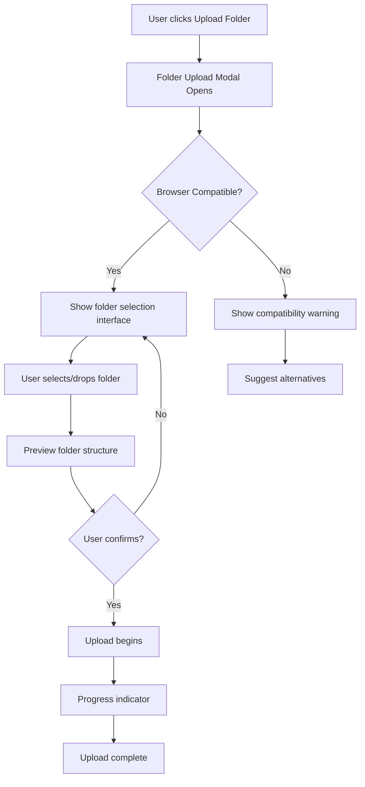

# 📁 Folder Upload Feature Enhancement Plan

## Executive Summary

This plan addresses the user confusion around folder upload functionality by creating a **separate, dedicated folder upload feature** that is more discoverable and intuitive. Instead of combining folder and file uploads in a single interface, we'll provide distinct upload experiences for each use case.

## Problem Statement

Current issues with folder upload:
- ❌ Folder upload is hidden within the general file upload interface
- ❌ Users don't understand how to upload folders
- ❌ No clear visual indicators that folder upload is supported
- ❌ Drag-and-drop for folders isn't intuitive
- ❌ No preview of folder structure before upload

## Solution Overview

Create a **dedicated folder upload feature** with:
- ✅ Separate "Upload Folder" button/card in the admin dashboard
- ✅ Clear modal interface specifically for folder uploads
- ✅ Visual folder structure preview before upload
- ✅ Step-by-step instructions and progress indicators
- ✅ Browser compatibility warnings when needed

---

## 📋 Phase 1: UI/UX Design & Planning

### 1.1 Design Mockups
**Timeline**: 2-3 days

#### Admin Dashboard Enhancement
```
┌─────────────────────────────────────────────┐
│           Admin Dashboard                    │
├─────────────────────────────────────────────┤
│                                             │
│  ┌─────────────┐  ┌─────────────┐         │
│  │   Upload     │  │   Upload     │         │
│  │   Files      │  │   Folder     │         │
│  │             │  │             │         │
│  │  📄 ➕      │  │  📁 ➕      │         │
│  └─────────────┘  └─────────────┘         │
│                                             │
│  ┌─────────────┐  ┌─────────────┐         │
│  │   Browse     │  │   Manage     │         │
│  │   Images     │  │   Folders    │         │
│  └─────────────┘  └─────────────┘         │
│                                             │
└─────────────────────────────────────────────┘
```

#### Folder Upload Modal Design
```
┌─────────────────────────────────────────────┐
│      📁 Upload Folder                    X  │
├─────────────────────────────────────────────┤
│                                             │
│  How to upload a folder:                    │
│  1. Click "Select Folder" or                │
│  2. Drag & drop a folder here               │
│                                             │
│  ┌ ─ ─ ─ ─ ─ ─ ─ ─ ─ ─ ─ ─ ─ ─ ─ ┐        │
│  │                                 │        │
│  │    📁 Drop folder here          │        │
│  │                                 │        │
│  │    [ Select Folder ]            │        │
│  └ ─ ─ ─ ─ ─ ─ ─ ─ ─ ─ ─ ─ ─ ─ ─ ┘        │
│                                             │
│  ⚠️ Note: Folder upload requires modern     │
│     browser (Chrome, Edge, Opera)           │
│                                             │
└─────────────────────────────────────────────┘
```

### 1.2 User Flow Design



---

## 📋 Phase 2: Component Development

### 2.1 Create FolderUploadModal.vue
**Timeline**: 2 days

```vue
<template>
  <Dialog v-model:visible="visible" modal header="Upload Folder" :style="{ width: '50vw' }">
    <!-- Clear instructions -->
    <div class="mb-4">
      <h3>📁 Upload an Entire Folder</h3>
      <p>Upload all files and subfolders at once while preserving the folder structure.</p>
    </div>

    <!-- Browser compatibility check -->
    <Message v-if="!browserSupported" severity="warn">
      <p>Your browser doesn't support folder upload. Please use Chrome, Edge, or Opera.</p>
    </Message>

    <!-- Folder selection area -->
    <div v-if="browserSupported" class="folder-drop-area" 
         @drop="handleDrop" 
         @dragover.prevent
         @click="selectFolder">
      <i class="pi pi-folder-open" style="font-size: 3rem;"></i>
      <p>Drop a folder here or click to select</p>
      <Button label="Select Folder" icon="pi pi-folder" />
    </div>

    <!-- Folder preview -->
    <div v-if="folderStructure" class="folder-preview mt-4">
      <h4>Preview:</h4>
      <Tree :value="folderStructure" />
      <p class="text-sm">{{ fileCount }} files will be uploaded</p>
    </div>

    <!-- Action buttons -->
    <template #footer>
      <Button label="Cancel" @click="visible = false" text />
      <Button label="Upload" @click="startUpload" :disabled="!folderStructure" />
    </template>
  </Dialog>
</template>
```

### 2.2 Update AdminDashboard.vue
**Timeline**: 1 day

Add new action card for folder upload:

```vue
<!-- Separate Upload Actions -->
<div class="col-12 md:col-6 lg:col-3">
  <div class="action-card" @click="showFileUpload">
    <i class="pi pi-file action-icon"></i>
    <h3>Upload Files</h3>
    <p>Upload individual image files</p>
  </div>
</div>

<div class="col-12 md:col-6 lg:col-3">
  <div class="action-card" @click="showFolderUpload">
    <i class="pi pi-folder action-icon"></i>
    <h3>Upload Folder</h3>
    <p>Upload entire folder with structure</p>
  </div>
</div>
```

### 2.3 Implement Folder Structure Preview
**Timeline**: 1 day

Create a visual tree preview of the folder structure before upload:

```javascript
function buildFolderPreview(entries) {
  const root = {
    key: '0',
    label: 'Selected Folder',
    icon: 'pi pi-folder',
    children: []
  };

  // Build tree structure for preview
  entries.forEach(entry => {
    // Add to tree with proper nesting
  });

  return [root];
}
```

---

## 📋 Phase 3: Enhanced User Experience

### 3.1 Add Visual Indicators
**Timeline**: 1 day

- Add folder icon badges to indicate folder upload capability
- Highlight drop zones when dragging folders
- Show folder structure animation during processing

### 3.2 Create Onboarding Flow
**Timeline**: 1 day

First-time user tutorial:
```javascript
const folderUploadTutorial = {
  steps: [
    {
      target: '.folder-upload-button',
      content: 'Click here to upload an entire folder with all its contents'
    },
    {
      target: '.folder-drop-area',
      content: 'You can drag and drop a folder here, or click to select one'
    },
    {
      target: '.folder-preview',
      content: 'Preview your folder structure before uploading'
    }
  ]
};
```

### 3.3 Implement Smart Detection
**Timeline**: 1 day

Detect when users try to upload multiple files and suggest folder upload:

```javascript
// In file upload handler
if (files.length > 10) {
  showSuggestion('Uploading many files? Try our folder upload feature for easier organization!');
}
```

---

## 📋 Phase 4: Browser Compatibility

### 4.1 Progressive Enhancement
**Timeline**: 1 day

```javascript
const browserSupport = {
  checkFolderUploadSupport() {
    const input = document.createElement('input');
    input.type = 'file';
    return 'webkitdirectory' in input;
  },

  getFallbackInstructions() {
    return {
      firefox: 'Folder upload is not supported. Please use Chrome or Edge.',
      safari: 'Use Chrome or Edge for folder upload, or upload files individually.',
      mobile: 'Folder upload is only available on desktop browsers.'
    };
  }
};
```

### 4.2 Alternative Methods
**Timeline**: 1 day

For unsupported browsers:
- Provide ZIP file upload option
- Show instructions for batch file selection
- Link to browser download pages

---

## 📋 Phase 5: Testing & Validation

### 5.1 User Testing
**Timeline**: 2 days

Test scenarios:
- [ ] New user discovers folder upload without help
- [ ] User successfully uploads nested folder structure
- [ ] User understands browser limitations
- [ ] Error messages are clear and helpful

### 5.2 A/B Testing
**Timeline**: 1 week

Compare:
- Combined upload interface vs. Separate interfaces
- Icon variations (folder icons, upload arrows)
- Instruction text variations
- Modal size and layout options

---

## 📋 Phase 6: Documentation & Launch

### 6.1 User Documentation
**Timeline**: 1 day

Create:
- Video tutorial for folder upload
- FAQ section for common issues
- Browser compatibility matrix
- Troubleshooting guide

### 6.2 Launch Plan
**Timeline**: 1 day

1. **Soft Launch**: Enable for 10% of users
2. **Monitor**: Track usage and error rates
3. **Iterate**: Fix issues based on feedback
4. **Full Launch**: Roll out to all users

---

## Success Metrics

### Quantitative Metrics
- 📈 Folder upload usage increases by 200%
- 📉 Support tickets about folder upload decrease by 80%
- ⏱️ Time to first successful folder upload < 2 minutes
- ✅ Success rate for folder uploads > 95%

### Qualitative Metrics
- Users report folder upload is "easy to find"
- No confusion about how to upload folders
- Positive feedback on the separated interface
- Users appreciate the preview feature

---

## Implementation Timeline

```
Week 1: Design & Planning
├── Day 1-2: Create mockups and flows
├── Day 3: Review and iterate designs
└── Day 4-5: Finalize specifications

Week 2: Core Development
├── Day 1-2: FolderUploadModal component
├── Day 3: Dashboard integration
├── Day 4: Preview functionality
└── Day 5: Browser compatibility

Week 3: Enhancement & Testing
├── Day 1: Visual indicators
├── Day 2: Onboarding flow
├── Day 3-4: User testing
└── Day 5: Bug fixes

Week 4: Documentation & Launch
├── Day 1: Create documentation
├── Day 2: Soft launch (10%)
├── Day 3-4: Monitor and iterate
└── Day 5: Full launch
```

---

## Risk Mitigation

### Technical Risks
- **Browser Compatibility**: Provide clear fallbacks and alternatives
- **Large Folder Handling**: Implement chunked uploads and progress indicators
- **Network Interruptions**: Add resume capability for large uploads

### UX Risks
- **User Confusion**: Extensive testing and clear instructions
- **Feature Discovery**: Prominent placement and onboarding
- **Migration Friction**: Keep old interface available temporarily

---

## Conclusion

This plan transforms the folder upload feature from a hidden capability to a **prominent, user-friendly feature**. By separating folder and file uploads, we:

1. ✅ Make folder upload immediately discoverable
2. ✅ Provide clear, contextual instructions
3. ✅ Show folder structure preview before upload
4. ✅ Handle browser compatibility gracefully
5. ✅ Create a delightful user experience

The phased approach ensures we can iterate based on user feedback while maintaining system stability.